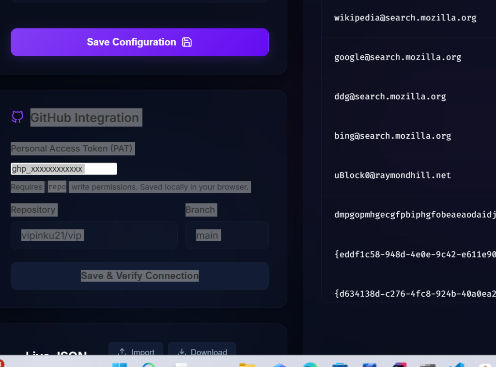

# Browser Extension Policy Manager - Access & Setup Guide

This document provides a complete guide to accessing, configuring, and using the **Browser Extension Policy Manager** web interface to manage your organization's browser extension whitelist and blacklist policies (`policy.json`).

---

## 1. Interface Overview

Below is the user interface of the Extension Policy Manager. It features a rule configuration form on the left, Git integration settings, a live JSON code preview, and an active policies database table on the right.



---

## 2. Quick Setup & Access Methods

Because this is a serverless, static HTML/JS/CSS frontend application, you can access and run it in three different ways depending on your company's network and hosting setup:

### Method A: Host on GitLab Pages (Team Access)
If your company GitLab instance has runner agents online, the website will build and host automatically:
1. Go to your GitLab repository (e.g., `BrowserExtension_JsonFormatter`).
2. Navigate to **Deploy** $\rightarrow$ **Pages** in the left sidebar.
3. Click the Pages URL shown at the top (e.g., `https://vanbogk.gitlab.io/BrowserExtension_JsonFormatter/` or your company's custom domain).

### Method B: Run Locally via a Static Web Server (Individual Access)
If your company GitLab instance does not have build runners enabled, you can run the files locally on your computer. It will still connect to the remote GitLab server over the network:
1. Clone or copy the project folder to your local computer.
2. Start a local server inside the folder using one of the following commands:
   * **Python**: Open Command Prompt in the folder and run:
     ```cmd
     python -m http.server 8000
     ```
     Then open: `http://localhost:8000`
   * **Node.js**: Open Command Prompt in the folder and run:
     ```cmd
     npx http-server -p 8000
     ```
     Then open: `http://localhost:8000`

---

## 3. Git Integration Setup (Connecting to GitLab)

Since the website reads and writes directly to your central repository, you need to authenticate using a **Project Access Token** (especially if you only have access to this specific repository and cannot generate a user-level token):

### Step 1: Generate your Access Token in GitLab
1. Open your project page in GitLab.
2. In the left sidebar menu, click **Settings** $\rightarrow$ **Access Tokens** (located between *Webhooks* and *Repository*).
3. Click **Add new token** (or *New Project Access Token*).
4. Configure the token:
   * **Token name**: E.g., `JsonFormatter-Editor`.
   * **Role**: Select **Developer** or **Maintainer** (required to grant write permissions to save files).
   * **Scopes**: Check the **`api`** scope checkbox.
5. Click **Create project access token** and copy the generated token string immediately.

### Step 2: Configure the Webpage Connection
1. Open the website in your browser.
2. Locate the **Git Integration** card on the left:
   * **Git Provider**: Select **GitLab** in the dropdown.
   * **GitLab Instance URL**: Enter your company's GitLab address (e.g., `https://gitlab.bsci.bossci.com`).
   * **Access Token**: Paste your Project Access Token.
   * **Repository / Project Path**: Enter your repository path (e.g., `bscwsm/systems/BrowserExtension_JsonFormatter`).
   * **Branch**: Enter the branch name (e.g., `main`).
3. Click **Save & Verify Connection**.

Upon success, the integration inputs will disappear and show a green success card: **Connected to GitLab**. The website is now fully authorized to save configuration edits!

---

## 4. How to Edit and Manage Policies

### Adding or Updating a Rule
1. Locate the **Configure Rule** card on the left.
2. Enter the **Extension ID** (e.g., `uBlock0@raymondhill.net`). Use `*` to configure the default global policy.
3. Select the **Installation Mode**:
   * **Allowed**: The extension is whitelisted and can be installed by users.
   * **Blocked**: The extension is blacklisted. You can optionally type a custom **Block Message** explaining the restriction to your users.
4. Click **Save Configuration**. The changes will commit directly to the repository's `policy.json` file.

### Deleting a Rule
1. Find the rule in the **Active Policies** table on the right.
2. Click the red **Trash Can** icon next to the rule.
3. Confirm the deletion. The rule will be removed from the table and the repository file automatically.

### Concurrent Users Safeguard (Optimistic Locking)
To prevent data loss, the web editor automatically tracks the version of the `policy.json` file:
* If another administrator saves changes to the repository while you have the webpage open, and you try to click save, the website will **block your save** and display a warning.
* Simply **reload the page** to merge their updates, and then re-apply your changes.
